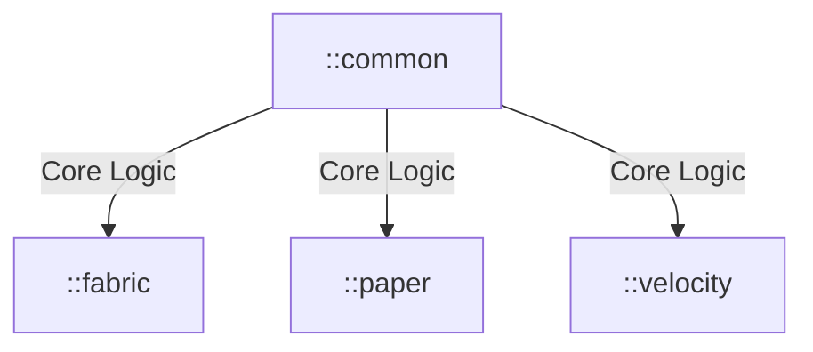

# 🐬 GolphineMC Core


**GolphineMC** is the custom-built infrastructure powering the **GolphineMC Network**.
It unifies the game logic across our Proxy (Velocity), Survival (Paper), and Modded (Fabric) instances.

> **⚠️ WARNING:** This repository contains proprietary code and logic specific to the GolphineMC server. It is not
> intended for public distribution or use.

## 🏗️ Architecture

This project uses a **Multi-Module Gradle** setup to inject shared business logic (`:common`) into specific platforms.



### Module Breakdown

| Module    | Scope      | Description                                                                 |
|-----------|------------|-----------------------------------------------------------------------------|
| :common   | Shared     | Database models, redis events, global logging, and utility classes.         |
| :fabric   | Client/Mod | Custom implementations for the modded instance (Side-Client & Side-Server). |
| :paper    | Survival   | Game mechanics, economy, and protections for the main server.               |
| :velocity | Proxy      | Network handling, authentication, and load balancing.                       |

## 🚀 Build Instructions (Internal Team)

To deploy updates to the production servers:

1. **Clone the repo:**
    ```bash
    git clone https://github.com/freitaseric/GolphineMC.git]
    ```
2. **Build artifacts:**
    ```bash
    ./gradlew clean build
    ```
3. **Deploy:** The output jars will be located in `build/libs/` of each module. Upload them to the respective server
   folders via SFTP.

## 🔒 License & Usage

Copyright © 2025 Eric Freitas Sampaio. All Rights Reserved.

This source code is the intellectual property of the GolphineMC Network. Unauthorized copying, modification,
distribution, or use of this file, via any medium, is strictly prohibited.